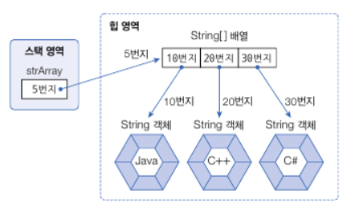

# 자바의 데이터 타입

자바의 데이터 타입은 `기본타입`(primitive type)과 `참조 타입`(reference type)으로 분류된다.

---
## 기본타입과 참조타입

**기본타입의 유형**
- 정수타입: `byte`, `short`, `char`, `int`, `long`
- 실수타입: `float`, `double`
- 논리타입:  `boolean`

**참조타입의 유형**
-  참조 타입이란 **객체의 주소값을 참조하는 타입**이다.
- `Array`, `Enum`, `Class`, `Interface`

---
**기본 타입과 참조 타입의 차이**
- 기본 타입으로 선언된 변수는 **값 자체**를 저장하지만 참조 타입으로 선언된 변수는 **객체가 생성된 메모리 번지**를 저장한다.

---
**변수는 어디에 저장될까?**
- 변수들은 모두 `스택` 메모리 영역에 생성된다.
- 기본 타입의 변수들은 스택 메모리에 값 자체를 저장하고 있지만 참조 타입의 경우
힙 영역에 생성된 객체의 주소값을 스택 영역에서 저장하고 이 값을 통해 힙 영역의 객체를 참조한다. (포인터라고 생각)

---
### 메모리 영역

:::tip  
java 명령어로 JVM이 구동되면 JVM은 OS에서 할당받은 메모리 영역을 여러 부분으로 구분하여 사용한다.
:::

1. **메소드 영역**
    - **바이트 코드 파일** 영역이 저장되는 영역
    - **클래스별**로 `상수`, `정적 필드`, `메소드 코드`, `생성자 코드` 등이 저장된다.

2. **힙 영역**
    - 객체가 생성되는 영역이다.
    - 객체의 주소는 <U>메소드 영역</U>과 <U>스택 영역의 상수와 변수</U>에서 참조할 수 있다.
3. **스택 영역**
    - 프로세스의 스레드들은 각자의 스택 영역을 가지며 스택 영역에는 `프레임`을 저장할 수 있다.
    - 메소드를 호출할 때마다 생성되는 `프레임`이 저장되는 영역이다. 
    - 메소드 호출이 끝나면 프레임은 자동적으로 제거된다.
    - 프레임 내부에는 로컬 변수 스택이 있으며 여기서 기본 타입과 참조 타입 변수가 생성되고 제거된다.

----

### 참조 타입 값 비교

- 변수의 값은 `==`, `!=` 으로 조사할 수 있다. 하지만 참조 타입의 경우 객체의 주소를 저장하기 때문에 주소가 같다면 **같은 객체**를 참조하는 것이고 아니면 **다른 객체**를 참조하는 것이다.

```java
int[] arr1;
int[] arr2;
int[] arr3;

int[] arr1 = new int[]{1, 2, 3};
int[] arr2 = new int[]{1, 2, 3};
arr3 = arr2;
```
- 이 예제에서 `arr1` 과 `arr2`는 다른 객체이다.
- arr3은 arr2의 메모리 주소값을 가지기 때문에 동일한 객체을 참조한다.


### null과 NullPorterException

- 참조 타입 변수는 아직 주소를 가지지 않았다는 뜻으로 `null` 값을 가질 수 있다.
- `null`도 초기값으로 사용할 수 있고 `null`로 초기화된 참조 변수를 스택 영역에 생성한다.

```java
String sVar = "5";
String nullVal = null;
```

참조 타입 변수가 null 값을 가지는지 확인하려면 `==`, `!=` 연산을 사용할 수 있다.
```java
sVar == null // false
nullVar == null // true
```

런타임에 발생하는 오류를 **예외**라고 하며 참조 타입을 사용할 때 가장 많이 발생하는 예외 중 하나는 `NullPointerException`이다. 이는 변수가 null인 상태에서 객체의 데이터나 메소드를 사용하려할 때 발생한다.

```java
// arr가 참조하는 배열 객체가 없어 값을 저장할 수 없다.
int[] arr = null;
arr[0] = 10; // NullPointerException

// str가 참조하는 String 객체가 없어 객체의 메소드를 사용할 수 없다.
String s = null;
System.out.println("s: " + s); // s: null
System.out.println("s의 길이: " + s.length);

// s의 객체주소값
System.out.println("s의 hash 값: " + System.identityHashCode(s)); // s의 hash 값: 0
```

---

## 문자열 타입

자바의 **문자열**은 Stirng 객체로 생성된다.

```java
String s1; // String 타입 변수 s1 선언
s1 = "s1"; // s1 변수에 문자열 대입

String s2 = "s2"; // String 타입 변수 s2를 선언하고 문자열 대입
```

### 문자열 비교

자바는 문자열 리터럴이 동일하다면 String 객체를 **공유**하도록 설계되어 있다. 

```java
// s1과 s2는 문자열 리터럴이 동일하다.
String s1 = "s";
String s2 = "s";

// s1과 s2는 동일한 객체 주소갑을 가진다.
System.out.println("s1의 hash 값: " + System.identityHashCode(s1)); // s1의 hash 
System.out.println("s2의 hash 값: " + System.identityHashCode(s2)); // s2의 hash 
```
- `new` 연산자는 새로운 객체를 만드는 연산자로 **객체 생성 연산자**라고 한다.
- `new`를 통해 객체를 생성하면 문자열 리터럴 값이 같아도 서로 다른 String 객체의 번지를 가리킨다.
 
```java
String s1 = new String("s");
String s2 = new String("s");

System.out.println("s1의 hash 값: " + System.identityHashCode(s1)); // s의 hash 
System.out.println("s2의 hash 값: " + System.identityHashCode(s2)); // s의 hash 

// s1의 hash 값: 834600351
// s2의 hash 값: 1915318863
```

- **문자열 리터럴로 생성하는 경우** 와 **new 연산자로 생성하는 경우**에 따라 <u> 비교 연산자의 결과가 달라질 수 있다.</u>
    - 따라서 동일한 String 객체든 다른 String 객체든 상관없이 내부 문자열만을 비교할 경우 **`equals()`** 메소드를 사용한다.

```java
String s1 = "s";
String s2 = new String("s");

System.out.println("result: " + s1.equals(s2));

// result: true
```

**빈 문자열 확인하기**
```java
String emptyStr = "";

if (emptyStr.equals("")) {
    System.out.println("emptyStr는 빈 문자열입니다. ");
}

// emptyStr는 빈 문자열입니다.
```
---
### 문자열 메소드

**1. 문자 추출**

- `charAt()` 
- 문자열에서 특정 위치의 문자 추출
 
```java
String s = "자바 프로그래밍";
char charVal = s.charAt(3); // 프
```

**2. 문자열 대체**
- `replcae(from, to)`
- 기존 문자열은 그대로 두고, 대체한 새로운 문자열을 리턴
- String 객체의 문자열은 `immutable` 하기 때문에 replace의 결과는 새로운 문자열이다. 

```java
String A = "자바 프로그래밍";
String B =  A.replace("자바", "JAVA");
```

**3. 문자열 잘라내기**
- `substring(int beginIdx)`
    - beginIdx부터 끝까지 잘라내기
- `substring(int beginIdx, int endIdx)`
    - beginIdx에서 endIdx 앞까지 잘라내기

```java
String s = "1234-5678";
String firstS = s.substring(0, 5); // 1234
String secondS = s.substring(6); // 5678
```

**4. 문자열 찾기**
- `indexOf()`
- 문자열에서 특정 문자열의 위치를 찾는 경우
- 주어진 문자열이 시작되는 인덱스를 리턴
- 만약 포함되지 않으면 -1을 리턴
- 단순히 포함되어 있는지 조사하고 싶은 경우 `contains()`를 사용

```java
String s = "자바 프로그래밍";
int idx = s.indexOf("프로그래밍"); // 3
```

**5. 문자열 분리**
- `split()`
- 구분자를 기준으로 분리된 문자열 배열을 리턴한다.

```java
String s = "A,B,C,D";
String[] arr = s.split(","); // [A, B, C, D]
```

## 배열 타입

**배열의 특징**
- 배열은 같은 타입의 값만 관리한다.
- 배열의 길이는 늘리거나 줄일 수 없다.
- 배열 변수는 참조 변수이다. 배열도 객체이므로 **힙 영역**에 생성되고 배열 변수는 힙 영역의 배열 주소를 저장한다.
- 참조할 배열이 없다면 null로 초기화할 수 있다. (`타입[] 변수 = null`)

**배열의 생성**

1. 값 목록으로 배열 생성
```java
타입[] 변수 = {값1, 값2, 값3, ...};
```

2. new 연산자로 배열 생성
```java
타입[] 변수 = new 타입[길이];
```

**배열의 초기값**
- new 연산자로 배열을 처음 생성하면 배열의 항목은 기본값으로 초기화된다.

| 기본타입 |초기값|참조타입| 초기값
|:---|:---|:---|:---|
|byte[]| 0 | 클래스[]| null|
|char[]|'\u0000'| 인터페이스[] | null|
|short[]|0| - | - |
|int[]|0| - | - |
|long[]|0L| - |-  |
|float[]|0.0F|-  |-  |
|double[]|0.0 |-  |-|


---
### 다차원 배열

- 배열 항목에는 또 다른 배열이 대입될 수 있으며 이러한 배열을 다차원 배열이라 한다.

**다차원 배열 생성하기**

- 1. 값 목록으로 다차원 배열 생성
    ```java
    타입[][] 변수 = {
        {값1, 값2, ...},
        {값3, 값4, ...}
    }
    ```

- 2. new 연산자로 다차원 배열 생성
    ```java
    타입[][] 변수 = new 타입[1차원수][2차원수][...]
    ```

**객체를 참조하는 배열**
- 기본 타입 배열은 각 항목에 값을 직접 저장하지만 참조 타입(클래스, 인터페이스) 배열은 각 항목에 객체의 번지를 저장한다.
- **String[] 배열의 각 항목은 String 변수와 동일하게 참조 타입 변수로 취급한다.**

```java
String[] strArr = new String[3];
strArr[0] = "java";
strArr[1] = "C++";
strArr[2] = "C#";
```




**배열 복사**
- 배열은 한 번 생성하면 길이를 변경할 수 없다. 더 많은 공간이 필요하다면 더 큰 배열의 길이를 새로 만들고 이전 배열로부터 항목을 복사해야한다.

1. for문을 사용한 방법

```java
int[] intArrFrom = {1,2,3};
int[] intArrTo = new int[5];

for(int i = 0; i < intArrFrom.length; i++) {
    intArrTo[i] = intArrfrom[i];
} 
// 1, 2, 3, 0, 0
```

2. **System의 arraycopy()를 사용한 방법**

:::tip
System.arraycopy(Object src, int srcPos, Object dest, int destPos, int length)

- Object src: 원본배열
- int srcPos: 원본 배열 복사 시작 인덱스
- Object dest: 새 배열
- int destPos: 새 배열 붙여넣기 시작 인덱스
- int length: 복사 항목 수

:::

```java
int[] intArrfrom = {1,2,3};
int[] intArrTo = new int[5];

System.arraycopy(intArrFrom, 0, intArrTo, 0, intArrFrom.length); // 1, 2, 3, 0, 0
```

---

## Enum 타입

데이터가 몇 가지로 한정된 값을 가지는 경우에 예를들어 요일은 월화수목금토일이라는 7개의 값을 가지는 타입을 열거형으로 사용할 수 있다.

**예시 1**
```java
public enum Week {
    // 열거 상수 목록
    MONDAY,
    TUESDAY,
    WEDNESDAY,
    THURSDAY,
    FRIDAY,
    SATURDAY,
    SUNDAY
}
```

**예시 2**
```java
public enum LoginResult {
    LOGIN_SUCCESS;
    LOGIN_FAILED;
}
```
---

**열거 타입 사용**
- 열거 타입도 하나의 데이터 타입이므로 변수를 선언하고 사용해야 한다.
- 열거 타입 변수에는 열거 상수를 대입할 수 있다. `열거타입.열거상수` 형태로 작성한다.


```java
Week today;
Week reservationDay;

Week today = Week.SUNDAY;
Week reservationDay = null; // 참조타입이므로 null값을 대입할 수 있다.
```

